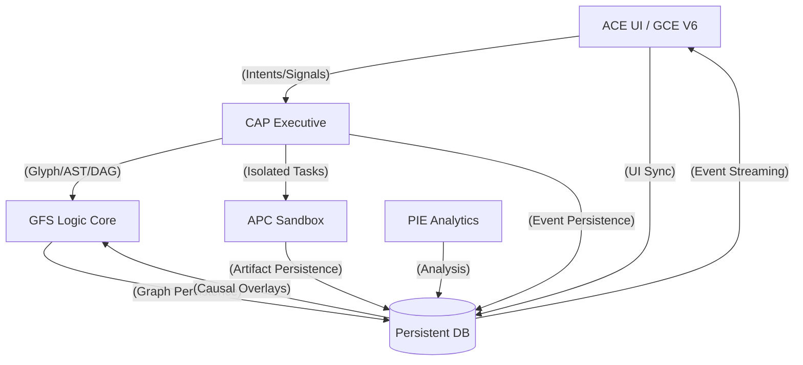

# 🧩 ARCHITECTURAL MERGER MAP: THE TIGHTLY COUPLED SUITE // v0.1.0

## 1. System Components (RRP-Revised)
- **ACE UI (Modified GCE)**: The primary host for asset creation, context generation, and intent refinement.
- **CAP CORE (CLIDE/APC/PIE)**: The unfinished executive, execution, and analysis backbone.
- **GFS SUBSTRATE (Integrated Glyph)**: The primary cognitive architecture for CAP, forming the core logic engine of the suite.

## 2. Integration Pathways

### A. GFS ↔ CAP Coupling (Super-Substrate)
- GFS is incorporated into the CAP node graph. 
- Substrate operations (Memory/Telemetry) are refactored to read/write directly to `cap_events.db`.
- **Conflict Strategy**: **Fork & Merge (Causal Branching)**. GFS maintains logic consistency by branching the graph when local mutations conflict with remote state.
- **The Loop**: A GFS graph mutation triggers a CLIDE Intent, which dispatches an APC task, which PIE then analyzes to update the GFS graph.

### B. UI ↔ BACKEND (Sync Engine)
- **Sync Protocol**: Local-First with aggressive atomic sync via WebSockets.
- **UI Strategy**: **Remote Wins / Timestamp Primacy**. The UI mirrors the Vault and Chat structures of GCE but persists them to the CAP database.
- **Visual Optimism**: The UI displays ghosted nodes/edges during execution, snapping back if the backend rejects the change.

### C. APC SANDBOX ↔ UI (Validation)
- APC dispatches an "Isolated Sandbox" per intent.
- Diffs are generated between the sandbox and the project root.
- **Artifacts**: Diffs are rendered in the UI via an "Inline Diff" toggle or a "Diff Analysis" modal.

### D. PIE ANALYSIS ↔ FULL SUITE (Introspection)
- PIE ingests `UI_SIGNAL` events (clicks, tab switches) to correlate user intent with system failures.
- PIE produces Markdown reports in `/reports/` and Causal Overlays on the GFS graph.

## 3. Data Flow Diagram (Decentralized)

---
*Verified by the RRP-forged ACE Sovereign Orchestrator.*
