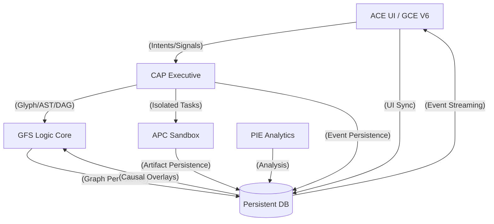

# 🌌 ACE SUITE: MASTER ARCHITECTURAL SPECIFICATION // v0.2.0

## 📑 Table of Contents
- [Rrp Synthesis](#rrp-synthesis)
- [01 Vision And Strategy](#01-vision-and-strategy)
- [09 Glossary Of Cognition](#09-glossary-of-cognition)
- [02 Architectural Merger Map](#02-architectural-merger-map)
- [03 Integration Specification](#03-integration-specification)
- [04 Context Engineering V6 Proposal](#04-context-engineering-v6-proposal)
- [05 Swarm Visualization Adapter](#05-swarm-visualization-adapter)
- [06 Implementation Roadmap](#06-implementation-roadmap)
- [07 Integration Contracts](#07-integration-contracts)
- [08 Security And Governance](#08-security-and-governance)
- [10 Migration Guide](#10-migration-guide)
- [11 Validation Specification](#11-validation-specification)
- [12 Future Roadmap](#12-future-roadmap)
- [13 Hyperdimensional Cognitive Map](#13-hyperdimensional-cognitive-map)

---

<a name="rrp-synthesis"></a>
## 📄 SOURCE: RRP_SYNTHESIS.md

# 📜 RRP_SYNTHESIS: ACE SUITE ARCHITECTURAL DECISIONS // v0.2.0

## 1. Overview
This document archives the final technical decisions reached during the **Recursive Refinement Protocol (RRP)** rounds. It serves as the sovereign foundation for the ACE Suite integration.

## 2. Core Decisions & Answers

### 🌀 Pillar Coupling & Logic
- **Decision**: **Tightly Coupled Super-Substrate**.
- **Detail**: GFS (Glyph) and CAP (CLIDE/APC/PIE) are unified. GFS substrates read/write directly to CAP's `cap_events.db`.
- **Serialization**: Agents utilize the **Triple-Pack** model (Glyph String, AST, IntentDAG).
- **Conflict Resolution**: **Causal Branching (Fork & Merge)**. GFS handles logic conflicts via branching; GCE handles UI conflicts via Remote-Wins.

### 🌀 GCE Library Architecture
The ACE UI (GCE V6) manages four distinct persistent libraries:
1. **Snippet Bank**: Atomic, reusable code/logic blocks.
2. **Context Vault**: Compound behavioral constitutions and high-level system rules.
3. **Architecture Collections**: Structural presets for context payload construction fields and schemas.
4. **Chat Sessions History**: The causal record of human-machine interaction, mapped to `trace_ids`.

### 🌀 Persistence & Synchronization
- **Decision**: **Decentralized Persistent State**.
- **Detail**: 
    - **CAP**: Executive events and intent scheduling.
    - **APC**: Project-level sandbox artifacts (.patch files).
    - **GFS**: Neural graph topology and substrate memory.
    - **GCE**: The 4 Libraries (Snippets, Vault, Arch, History).
- **Sync Engine**: Local-First with aggressive atomic fragment synchronization to the database via `ACE_SYNC_BUS`.

### 🌀 Sandbox & Validation
- **Decision**: **Isolated APC Sandbox with Project Diffs**.
- **Detail**: APC creates unique sandboxes to test proposed changes to the active project source code, producing verifiable diff artifacts for user review in GCE.

### 🌀 Analysis & Reporting
- **Decision**: **PIE-Powered Causal Introspection**.
- **Detail**: PIE analyzes UI interactions and system events to produce Markdown artifacts and visual graph overlays. PIE scores all data for **Janitorial Pruning** to `archive.db`.

---
*Verified by the RRP-forged ACE Sovereign Orchestrator.*


---

<a name="01-vision-and-strategy"></a>
## 📄 SOURCE: 01_VISION_AND_STRATEGY.md

# 🌌 ACE SUITE: THE UNIFIED SOVEREIGN PLATFORM // v0.2.0

## 1. Vision
The **ACE (Agentic Context Engineering) Suite** is the definitive convergence of **GCE (Interface)**, **GFS (Logic)**, and **CAP (Core)**. It transforms the development process from manual coding into a high-level **Orchestration of Cognitive Intent**. By merging finished UI components with emerging agentic pillars, we create a self-evolving system capable of engineering its own context, validating its own changes, and visualizing its own "thoughts."

## 2. Core Strategic Pillars

### 2.1 The Triple-Pack Cognitive Nucleus
The fundamental unit of logic in the ACE Suite is the **Triple-Pack**. Every behavior, rule, or intent is simultaneously represented as:
- **Glyph-Native Code**: For visual substrate operations.
- **Abstract Syntax Tree (AST)**: For deterministic machine manipulation.
- **IntentDAG**: For executive execution via CLIDE.
This "Nucleus" ensures that any modification—whether via visual graph editing or human-readable pseudocode—is consistently reflected across the entire system.

### 2.2 The Sovereign Context Forge (GCE V6)
GCE serves as the primary host for engineering the "Genes" of the system. It manages four authoritative libraries:
- **Snippet Bank**: The atomic building blocks of agentic behavior.
- **Context Vault**: High-level behavioral constitutions.
- **Architecture Collections**: Structural blueprints for neural graph topologies.
- **Chat Sessions History**: A causal, searchable record of human-machine interaction.

### 2.3 Decentralized Integrity
Persistence is distributed across components. **CAP** owns the executive event log, **APC** owns the project-level sandbox artifacts, and **GFS** owns the neural graph state. GCE synchronizes its libraries to this unified persistence layer, ensuring that the "UI state" is always a valid projection of the "System state."

### 2.4 Visual Optimism & Causal Guardrails
The Suite employs **Visual Optimism** to provide instantaneous feedback. However, all actions are subject to **Causal Reversion**. If the backend (PIE or APC) detects an invariant violation, the UI automatically reverts the affected subtree using Ghosting and Snap-back animations, preventing the propagation of "Cognitive Slop."

## 3. Success Metrics (The Semantic Horizon)
1. **Zero-Slop Execution**: 100% of project changes are validated in APC before commitment.
2. **Causal Transparency**: Every system decision can be traced back to its origin in the Chat History or the Neural Graph.
3. **Autopoietic Potential**: The system demonstrates the ability to refactor its own GCE libraries based on PIE introspection.

---
*Verified by the RRP-forged ACE Sovereign Orchestrator.*


---

<a name="09-glossary-of-cognition"></a>
## 📄 SOURCE: 09_GLOSSARY_OF_COGNITION.md

# 📖 GLOSSARY OF COGNITION: THE SOVEREIGN ACRONYM TREE // v0.2.0

## 1. The ACE Acronym Tree (Primary Hierarchy)
```text
CAP (Cognitive Architecture Platform) - THE PRIMARY ROOT
├── CLIDE (Cognitive Loop Intent Distribution Engine) - The Executive
│   ├── IDAG (Intent Directed Acyclic Graph) - Formal Plan
│   ├── SLC (Swarm Ledger & Comms) - Economic Persistence
│   └── SLC (Lamport Logical Clock) - Temporal Ordering
├── APC (Automated Personalized Context) - The Executioner
│   ├── ARM (Automated Resource Manager) - Execution Worker
│   ├── PRV (Pre-Execution Validation) - Sandbox Safety
│   ├── DSC (Deterministic State Capture) - Filesystem Hashing
│   └── SEH (Side-Effect Hash) - Mutation Verification
└── PIE (Praxis Inference Engine) - The Analyst
    ├── PCA (Praxis Causal Analysis) - Trace Reconstruction
    ├── DIA (Diagnostic Inference Agent) - Failure Mapping
    └── PIA (Predictive Inference Agent) - Anomaly Prevention

ACE (Agentic Context Engineering) Suite - THE UNIFIED INTERFACE
├── GCE (Gemini Context Engineer) - The Sovereign Forge
│   ├── SBK (Snippet Bank) - Atomic Logic
│   ├── CVL (Context Vault) - Compound Rules
│   ├── ARC (Architecture Collections) - Structural Presets
│   └── CSH (Chat Sessions History) - Causal Records
└── GFS (Glyph Formal System) - The Logic Substrate
    ├── COG (Cognitive Substrate) - Reasoning
    ├── MEM (Memory Substrate) - Persistence
    ├── TEL (Telemetry Substrate) - Observability
    └── TOP (Topology Substrate) - Graph Mutation
```

## 2. Proposed Additional Acronyms (For Review)
- **PRV**: Pre-Execution Validation
- **DSC**: Deterministic State Capture
- **SEH**: Side-Effect Hash
- **SBK**: Snippet Bank
- **CVL**: Context Vault
- **ARC**: Architecture Collections
- **CSH**: Chat Sessions History
- **PCA**: Praxis Causal Analysis
- **DIA/PIA**: Diagnostic/Predictive Inference Agents

## 3. Core Concepts
- **ACE Suite**: The unified integration of CAP, Glyph, and GCE UI.
- **IntentDAG (IDAG)**: A Directed Acyclic Graph representing a complex agentic goal.
- **Causal Loop**: The feedback cycle where CLIDE dispatches, APC executes, and PIE introspects.
- **Cognitive Particle**: A single event (payload + metadata) representing a "thought."
- **Singularity Pulse**: The real-time visual HUD of the ACE UI.
- **Genesis Hash**: The SHA-256 identity anchor generated at system birth.

---
*Verified by the RRP-forged ACE Sovereign Orchestrator.*


---

<a name="02-architectural-merger-map"></a>
## 📄 SOURCE: 02_ARCHITECTURAL_MERGER_MAP.md

# 🧩 ARCHITECTURAL MERGER MAP: THE TIGHTLY COUPLED SUITE // v0.1.0

## 1. System Components (RRP-Revised)
- **ACE UI (Modified GCE)**: The primary host for asset creation, context generation, and intent refinement.
- **CAP CORE (CLIDE/APC/PIE)**: The unfinished executive, execution, and analysis backbone.
- **GFS SUBSTRATE (Integrated Glyph)**: The primary cognitive architecture for CAP, forming the core logic engine of the suite.

## 2. Integration Pathways

### A. GFS ↔ CAP Coupling (Super-Substrate)
- GFS is incorporated into the CAP node graph. 
- Substrate operations (Memory/Telemetry) are refactored to read/write directly to `cap_events.db`.
- **Conflict Strategy**: **Fork & Merge (Causal Branching)**. GFS maintains logic consistency by branching the graph when local mutations conflict with remote state.
- **The Loop**: A GFS graph mutation triggers a CLIDE Intent, which dispatches an APC task, which PIE then analyzes to update the GFS graph.

### B. UI ↔ BACKEND (Sync Engine)
- **Sync Protocol**: Local-First with aggressive atomic sync via WebSockets.
- **UI Strategy**: **Remote Wins / Timestamp Primacy**. The UI mirrors the Vault and Chat structures of GCE but persists them to the CAP database.
- **Visual Optimism**: The UI displays ghosted nodes/edges during execution, snapping back if the backend rejects the change.


### C. APC SANDBOX ↔ UI (Validation)
- APC dispatches an "Isolated Sandbox" per intent.
- Diffs are generated between the sandbox and the project root.
- **Artifacts**: Diffs are rendered in the UI via an "Inline Diff" toggle or a "Diff Analysis" modal.

### D. PIE ANALYSIS ↔ FULL SUITE (Introspection)
- PIE ingests `UI_SIGNAL` events (clicks, tab switches) to correlate user intent with system failures.
- PIE produces Markdown reports in `/reports/` and Causal Overlays on the GFS graph.

## 3. Data Flow Diagram (Decentralized)


---
*Verified by the RRP-forged ACE Sovereign Orchestrator.*


---

<a name="03-integration-specification"></a>
## 📄 SOURCE: 03_INTEGRATION_SPECIFICATION.md

# 📡 INTEGRATION SPECIFICATION: THE DECENTRALIZED BUS // v0.1.0

## 1. Decentralized Persistence Responsibility
Each component MUST manage its own persistence layer in the unified database:
- **CLIDE**: Manages the `events` and `traces` tables in `cap_events.db`.
- **APC**: Manages execution artifacts and links them via the `causal_index`.
- **GFS**: Manages the neural graph state via its own substrate-to-DB bindings.
- **GCE (ACE UI)**: Manages UI-specific artifacts (Vault, Chat History) and subscribes to the `live` event bus.

## 2. ACE_EVENT_BUS (Streaming Protocol)
The system uses a **Reactive Projection** model. The UI does not poll; it listens to the `ACE_EVENT_BUS` and updates its local state reactively.
- **Source Filtering**: UI can subscribe to specific sources (e.g., `/ws/subsystem/APC` for real-time diffs).
- **Event Header**: Every event MUST carry the unified `trace_id` and `source` header.

## 3. GFS Causal Branching (Fork & Merge)
- When GFS detects a conflict between its local graph mutation and the remote state, it dispatches a `FORK_REQUEST` to CLIDE.
- CLIDE persists the branch.
- The UI (GCE) receives the `FORK_CREATED` event and prompts the user for a "Manual Reconciliation" via a visual diff interface.

## 4. APC Sandbox Artifacts
- APC executes in a unique sandbox per `trace_id`.
- Diffs are generated between the sandbox state and the **Active Project Root**.
- Diffs are saved as `.patch` files in `data/artifacts/`.
- The URI of the project-level artifact is pushed to the `ACE_EVENT_BUS` for immediate UI rendering and user review.

---
*Verified by the RRP-forged ACE Sovereign Orchestrator.*


---

<a name="04-context-engineering-v6-proposal"></a>
## 📄 SOURCE: 04_CONTEXT_ENGINEERING_V6_PROPOSAL.md

# 🎨 CONTEXT ENGINEERING V6: THE SOVEREIGN FORGE // v0.2.0

## 1. GCE: The Sovereign Context Forge
The ACE UI (GCE V6) is refactored from a standalone tool into the **Primary Context Forge**. It is the environment where system logic and agent behaviors are engineered, refined, and analyzed.

### Key Enhancements:
- **Context Refinement Engine**: GCE hosts the "Human Review Tool," which overlays LLM-generated pseudocode on the Triple-Pack (Glyph/AST/DAG) core for verification.
- **Output Analysis Interface**: A dedicated view for analyzing agent outputs and proposed logic mutations before they are committed to the GFS graph.
- **Distributed Sync Engine**: Only synchronizes UI-specific artifacts (Vault, Chat History). Subscribes to CAP/APC/GFS streams for all other data.
- **Visual Optimism (V6)**: Nodes and edges ghost immediately. If a `FORK_CREATED` or `ANOMALY_DETECTED` signal is received, the UI triggers the "Causal Reversion" animation.
- **Diff Analysis Modal**: A dedicated interface for reviewing APC-generated patches before "Refining" and committing to the project.
- **Triple-Pack Inspector**: A split-view editor showing Glyph-code, AST, and Human-Readable Pseudocode in synchronized blocks.

## 2. The Four Primary Libraries
GCE V6 organizes its data into four authoritative repositories, each with a specialized role in the context engineering lifecycle:

### 2.1 Snippet Bank (Atomic Logic)
- **Role**: Storage for atomic, reusable code blocks, rule definitions, and prompt fragments.
- **Usage**: Source material for the Payload Constructor. Snippets are tracked by PIE for "Effectiveness Scores."

### 2.2 Context Vault (Compound Rules)
- **Role**: Storage for complete behavioral constitutions and high-level system rules.
- **Usage**: Injected into CLIDE Intents to define agent personality and constraints.

### 2.3 Architecture Collections (Structural Presets)
- **Role**: Presets for context payload construction fields and schemas.
- **Usage**: Provides the "scaffolding" for complex data structures within the Payload Constructor, ensuring all generated contexts follow established architectural patterns.

### 2.4 Chat Sessions History (Causal Records)
- **Role**: A persistent, causal record of human-machine interaction.
- **Usage**: Each session is mapped to a `trace_id`, allowing users to "Replay" or "Fork" historical conversations into new agent behaviors.

## 3. UI Layout (RRP-Revised)
```text
[ HEADER: ACE SUITE V6 | SESSION: ACTIVE | SYNC: CONNECTED ]
---------------------------------------------------------
[ CHAT LIST ] | [ REACTIVE CHAT LOG / LOGIC ENGINE ] | [ HUD ]
[ VAULT     ] | [                                  ] | [ PIE ]
[ SNIPPETS  ] | [ [DIFF OVERLAY / TRIPLE-PACK]     ] | [     ]
---------------------------------------------------------
[ TABS: VAULT | NEURAL GRAPH | SWARM | REPORTS | CONSOLE ]
[ CONTENT AREA (DRAWERS WITH GHOST REVERSION SUPPORT)    ]
```

---
*Verified by the RRP-forged ACE Sovereign Orchestrator.*


---

<a name="05-swarm-visualization-adapter"></a>
## 📄 SOURCE: 05_SWARM_VISUALIZATION_ADAPTER.md

# 🕸️ SWARM VISUALIZATION ADAPTER: GLYPH ↔ CAP // v0.1.0

## 1. The Bridge
A new script `glyph/swarm_bridge.py` will serve as the translator between **CAP's Causal Events** and **Glyph's Neural Geometry**.

### Responsibilities:
- **Event Ingestion**: Listen to `cap_events.db` or the CLIDE WebSocket bus.
- **Node Mapping**:
    - `INTENT_CREATE` → Create a new **Root Node** in Glyph.
    - `TASK_DISPATCH` → Create a **Child Node** and edge.
    - `TASK_COMPLETE` → Update node color to **SUCCESS (var(--success))**.
    - `ANOMALY_DETECTED` → Trigger a **Vibration Effect** on the affected node.
- **State Broadcasting**: Send updated graph JSON back to the ACE UI.

## 2. Telemetry Substrate Expansion
Update `glyph/src/backend/substrates.py` to handle the new **Swarm Telemetry** data:
```python
class SwarmSubstrate(TelemetrySubstrate):
    def update_from_cap(self, event):
        # Process CAP events and update the internal graph
        pass
```

## 3. The "Causal Canvas"
The Glyph canvas will render the **Dynamic DAG** of the current session.
- **User Message**: The starting point of the causal chain.
- **LLM Reasoning**: A cluster of processing nodes.
- **APC Execution**: A node with a distinct "sandbox" icon.
- **PIE Inference**: A set of feedback loops linking back to the origin.

## 4. Real-time Interactions
- **Click on Node**: Shows detailed CAP trace logs in the ACE UI sidebar.
- **Hover on Edge**: Shows the data payload being transferred.
- **Drag Node**: Manual reorganization of the visual topology.

---
*Generated by the ACE Sovereign Orchestrator.*


---

<a name="06-implementation-roadmap"></a>
## 📄 SOURCE: 06_IMPLEMENTATION_ROADMAP.md

# 🗺️ IMPLEMENTATION ROADMAP: DECENTRALIZED ACE // v0.1.0

## 1. Phase 1: The Synaptic Bridge (Foundations)
- [ ] **ACE-FOUND-01**: Refactor `server.py` and `stream_processor.py` for `ACE_EVENT_BUS` header support.
- [ ] **ACE-UI-01**: Implement GCE-to-CLIDE atomic synchronization for Vault/Chat artifacts.
- [ ] **ACE-GFS-01**: Bind GFS substrates directly to CAP SQLite ledgers.

## 2. Phase 2: The Logic Merger (Triple-Pack)
- [ ] **ACE-LOGIC-01**: Implement the Triple-Pack (Glyph/AST/DAG) serialization engine.
- [ ] **ACE-UI-02**: Build the Triple-Pack synchronized editor in the ACE UI.
- [ ] **ACE-GFS-02**: Implement GFS Causal Branching (Fork & Merge) logic in the substrate.

## 3. Phase 3: The Executioner's Loop (APC)
- [ ] **ACE-EXEC-01**: Implement APC Sandbox isolation and project-level directory diffing.
- [ ] **ACE-UI-03**: Build the "Inline Project Diff" and "Diff Analysis Modal" UI components.
- [ ] **ACE-EXEC-02**: Link project-level patch artifacts to the `causal_index` for PIE ingestion.

## 4. Phase 4: Introspection & Governance (PIE)
- [ ] **ACE-PIE-01**: Implement PIE causal overlays and Markdown report generation.
- [ ] **ACE-JANITOR-01**: Create `scripts/janitor.py` for PIE-driven archiving to `archive.db`.
- [ ] **ACE-UI-04**: Build the Janitorial Dashboard for archive monitoring.

## 5. Phase 5: Autopoietic Finalization
- [ ] **ACE-E2E-01**: Verify the full loop: UI → Intent → Sandbox → PIE Analysis → GFS Update.
- [ ] **ACE-DOC-01**: Consolidate all RRP-forged docs and increment Suite version to `v0.1.0`.

---
*Verified by the RRP-forged ACE Sovereign Orchestrator.*


---

<a name="07-integration-contracts"></a>
## 📄 SOURCE: 07_INTEGRATION_CONTRACTS.md

# 📡 ACE INTEGRATION CONTRACTS: THE TRIPLE-PACK SCHEMA // v0.1.0

## 1. The Triple-Pack Cognitive Particle
Every agent logic or system intent MUST be encapsulated in this schema:
```json
{
  "particle_id": "uuid-v4",
  "glyph_code": "⟐(...)⟳",
  "ast": { "type": "Program", "body": [] },
  "intent_dag": { "nodes": [], "edges": [] },
  "metadata": {
    "author": "human | machine",
    "pseudocode": "Human-readable explanation",
    "version": "1.0.0"
  }
}
```

## 2. Sync Protocol (ACE_SYNC_BUS)
Messages for the Local-First synchronization loop:
```json
{
  "sync_id": "uuid",
  "action": "SYNC_FRAGMENT | SYNC_KEYSTROKE | SYNC_RECONCILE",
  "target": "chats | snippets | contexts | graph",
  "payload": {},
  "timestamp": "ISO-8601"
}
```

## 3. APC Diff Artifacts
Schema for sandboxed execution reports:
```json
{
  "trace_id": "uuid",
  "exit_code": 0,
  "diff_summary": "3 files changed, 42 insertions(+)",
  "diff_patch": "raw patch string",
  "artifacts": [
    { "path": "data/artifacts/[uuid].patch", "type": "patch" }
  ]
}
```

## 4. PIE Introspection Reports
Schema for causal trace artifacts:
```json
{
  "report_id": "diag-uuid",
  "causal_score": 0.85,
  "inferred_failure_node": "glyph_node_id",
  "markdown_path": "reports/TRACE_[ID]_DIAG.md",
  "visual_overlay": {
    "type": "GHOST_SUBTREE | VIBRATION_PULSE",
    "affected_nodes": []
  }
}
```

---
*Verified by the RRP-forged ACE Sovereign Orchestrator.*


---

<a name="08-security-and-governance"></a>
## 📄 SOURCE: 08_SECURITY_AND_GOVERNANCE.md

# 🛡️ SECURITY & GOVERNANCE: ACE SUITE // v0.1.0

## 1. The Sandbox Invariant
All code execution initiated from the ACE UI MUST be routed through **APC Cannon**. 
- **Rule**: Direct shell access from the UI is deprecated.
- **Enforcement**: Any `EXEC_REQUEST` not containing an `apc_sandbox_token` will be rejected by CLIDE.

## 2. Permission Tiers
- **TIER-0 (Observer)**: Read-only access to the `ACE_EVENT_BUS` and `/api/fs/read`.
- **TIER-1 (Agent)**: Can dispatch `INTENT_REQUEST` events to the swarm.
- **TIER-2 (Architect)**: Full access to `/api/fs/write` and the ability to refactor the CLIDE kernel.
- **TIER-3 (Sovereign)**: Can trigger `autonomous_introspection.py` and modify PIE inference flavours.

## 3. Data Integrity
- **Immutable Ledger**: The `cap_events.db` is the single source of truth.
- **Signature Verification**: Future iterations will require all `UI_SIGNAL` events to be signed by the client's session key.
- **Memory Decay**: PIE is authorized to prune stale or "noisy" events from the UI's telemetry to prevent buffer bloat.

## 4. Anomaly Response Protocol
When PIE detects a `SECURITY_VIOLATION`:
1. **Immediate Lock**: The ACE UI will enter "Locked" mode (isLocked = true).
2. **Trace Isolation**: The offending `trace_id` will be quarantined in `cap_events.db`.
3. **Audit Report**: PIE will generate an `ANOMALY_DETECTED` report for the Sovereign Architect.

---
*Verified by the RRP-forged ACE Sovereign Orchestrator.*


---

<a name="10-migration-guide"></a>
## 📄 SOURCE: 10_MIGRATION_GUIDE.md

# 🏗️ MIGRATION GUIDE: THE DECENTRALIZED TRANSITION // v0.2.0

## 1. Overview
This guide covers the transition from standalone GCE V5 and GFS-III components into the unified ACE Suite v0.1.0. The primary focus is the **Decentralization of Persistence** and the migration of the 4 Libraries into the persistent DB.

## 2. Data Migration: The 4-Library Export
The legacy GCE LocalStorage data must be migrated to the `cap_swarm.db` (for libraries) and `cap_events.db` (for history).

### Migration Step (ACE-MIG-01):
A new script `scripts/migrate_v5_to_ace.py` will perform the following mapping:
- **`gce_v5_snips`** → `library_snippets` table (Source for Snippet Bank).
- **`gce_v5_contexts`** → `library_vault` table (Source for Context Vault).
- **`gce_v5_arch_presets`** (if exists) → `library_architecture` table (Source for Architecture Collections).
- **`gce_v5_chats`** → `events` table (Causal reconstruction into Chat History).

## 3. Communication Migration: Event-Bus Adoption
- **Legacy**: UI components using isolated LocalStorage and direct fetch calls.
- **ACE**: UI components subscribing to the `ACE_EVENT_BUS` for real-time state projection.

### Migration Step (ACE-MIG-02):
Update `context.html` (becoming `ui/index.html`) to:
1. Establish a persistent WebSocket connection to `/ws/live`.
2. Initialize local state by fetching the "Full Mesh" from `/api/observability/full_mesh`.
3. Listen for `COGNITIVE_EVENT` and `AGENT_STATE` updates to drive UI reactivity.

## 4. GFS Substrate Migration
- **Legacy**: Substrates (Memory, Telemetry) using in-memory dicts or local JSON files.
- **ACE**: Substrates refactored to use SQLite bindings for `cap_events.db`.

### Migration Step (ACE-MIG-03):
Update `glyph/src/backend/substrates.py` to:
1. Replace `self.storage = {}` with a database connection pool.
2. Implement atomic `save_node()` and `load_graph()` methods using SQL transactions.

## 5. System Boot Order (Unified Launcher)
A new script `scripts/launch_ace_suite.py` will:
1. Start Redis (for Celery/Swarm support).
2. Launch the CLIDE Dashboard Server (`core/clide/dashboard/server.py`).
3. Start the local APC ARM worker node.
4. Launch the ACE UI (`ui/index.html`) via a local web server (FastAPI).

---
*Verified by the RRP-forged ACE Sovereign Orchestrator.*


---

<a name="11-validation-specification"></a>
## 📄 SOURCE: 11_VALIDATION_SPECIFICATION.md

# ✅ VALIDATION SPECIFICATION: THE RRP-FORGED SUITE // v0.1.0

## 1. Test Tier Evolution
Validation in the ACE Suite moves beyond unit tests into **Causal Integrity Verification**.

## 2. Technical Validation Tiers

### TIER-1: Semantic Determinism (Triple-Pack)
- **ACE-VAL-01**: Verify that a Glyph string compiles to an AST and IntentDAG with 100% parity.
- **ACE-VAL-02**: Verify that Human-Readable pseudocode can be re-compiled into the same Triple-Pack (LLM-validation).

### TIER-2: Sync Fidelity (Local-First)
- **ACE-VAL-03**: Verify aggressive keystroke/fragment sync latency is < 200ms.
- **ACE-VAL-04**: Simulate a WebSocket disconnection and verify that a "Fork & Merge" event is triggered upon reconnection.

### TIER-3: Execution Isolation (APC Diffs)
- **ACE-VAL-05**: Run an execution in an APC Sandbox and verify that NO files outside the sandbox are modified.
- **ACE-VAL-06**: Verify that the generated `.patch` artifact accurately represents the changes made within the sandbox.

### TIER-4: Introspection Accuracy (PIE)
- **ACE-VAL-07**: Inject a synthetic failure into the GFS graph and verify that PIE identifies the correct "Inferred Failure Node."
- **ACE-VAL-08**: Verify that PIE "Scoring" correctly identifies low-relevance events for janitorial pruning.

## 3. Visual Optimism Success Metrics
- **Reversion Speed**: Ghost/Snap-back animations must trigger within 100ms of an `ANOMALY_DETECTED` event.
- **UI Persistence**: 100% of LocalStorage state must be recoverable from the `cap_events.db` after a full cache wipe.

---
*Verified by the RRP-forged ACE Sovereign Orchestrator.*


---

<a name="12-future-roadmap"></a>
## 📄 SOURCE: 12_FUTURE_ROADMAP.md

# 🚀 FUTURE ROADMAP: THE ACE HORIZON // v0.1.0

## 1. Post-Foundational Objectives
Once the **ACE Suite v0.1.0** is stable, the following high-level modules will be initiated.

## 2. The Context-to-Intent Translation Module
- **Goal**: A cross-component module (likely hosted within GCE) that performs native translation between high-level human-readable context and the Triple-Pack (Glyph/AST/DAG) core.
- **Mechanism**: LLM-driven "Semantic Compilation" with a deterministic AST-to-Glyph optimizer.
- **Priority**: HIGH (Post-Phase 4).

## 3. Multi-Node Mesh Orchestration
- **Goal**: Expand CLIDE's distribution engine to support heterogeneous nodes (e.g., hybrid Termux/Windows execution).
- **Mechanism**: Tailscale-based mesh networking with hybrid path abstraction.
- **Priority**: MEDIUM.

## 4. Autonomous Introspection (PIE Phase 2)
- **Goal**: Move PIE from "Diagnostic" to "Predictive" inference.
- **Mechanism**: PIE analyzes historical `archive.db` traces to predict likely failure modes before they occur in the GFS graph.
- **Priority**: MEDIUM.

## 5. Autopoietic UI Refactoring
- **Goal**: Allow the ACE Suite to propose and execute its own UI layout updates based on user interaction patterns.
- **Mechanism**: GCE Context Engineering applied to its own frontend source code.
- **Priority**: LOW.

---
*Verified by the RRP-forged ACE Sovereign Orchestrator.*


---

<a name="13-hyperdimensional-cognitive-map"></a>
## 📄 SOURCE: 13_HYPERDIMENSIONAL_COGNITIVE_MAP.md

# 🌌 ACE SUITE: HYPER-DIMENSIONAL COGNITIVE MAP // v0.2.0

## 1. The Sovereign Cognitive Mesh
This map represents the interconnected "state-space" of the ACE Suite. Lines (`──`, `│`) represent structural hierarchy, while "Quantum Bridges" (`⇢`, `⇠`) represent the tightly-coupled causal cross-talk between distant substrates.

```text
[ DIMENSION: PERCEPTION ]          [ DIMENSION: WILL ]           [ DIMENSION: LOGIC ]
       (PIE)                              (CLIDE)                       (GFS)
         │                                   │                            │
   PCA ──┼── DIA                       IDAG ──┼── SLC               COG ──┼── TOP
         │                                   │                            │
   PIA ──┼── CSH                       HITL ──┼── Goal              MEM ──┼── TEL
         │                                   │                            │
         ▼                                   ▼                            ▼
   [ CAUSAL LOG ] ⇠─────────── ACE_EVENT_BUS ───────────⇢ [ NEURAL GRAPH ]
         ▲                                   ▲                            ▲
         │                                   │                            │
         │          [ DIMENSION: EXECUTION (APC-CANNON) ]                 │
         │                           │                                    │
         └──────────────────⇢ ARM ───┼─── PRV ────────────────────────────┘
                             DSC ───┼─── SEH
                                     │
                                     ▼
                          [ PROJECT SOURCE CODE ]
```

## 2. Exhaustive Acronym Index (By Dimension)

### 🛰️ AXIS A: EXECUTIVE (The Will)
- **CAP**: Cognitive Architecture Platform (The Root)
- **CLIDE**: Cognitive Loop Intent Distribution Engine (Executive)
- **IDAG**: Intent Directed Acyclic Graph (The Formal Plan)
- **SLC**: Swarm Ledger & Comms (Economic Record)
- **SLC-L**: Lamport Logical Clock (Temporal Sync)
- **HITL**: Human-in-the-Loop (GCE User Interaction)
- **TTL**: Time-to-Live (Intent Expiration)
- **RRP**: Recursive Refinement Protocol (The Blueprinting Standard)

### 🧠 AXIS B: NEURAL (The Logic)
- **GFS**: Glyph Formal System (Logic Core)
- **COG**: Cognitive Substrate (LLM Reasoner)
- **MEM**: Memory Substrate (Graph Persistence)
- **TEL**: Telemetry Substrate (Visual Feedback)
- **TOP**: Topology Substrate (Graph Mutation)
- **AST**: Abstract Syntax Tree (Machine-readable Logic)
- **DSL**: Domain Specific Language (The Glyph Operators)
- **JIT**: Just-In-Time (Dynamic Glyph Compilation)

### 🛠️ AXIS C: MECHANICAL (The Action)
- **APC**: Automated Personalized Context (Execution Pillar)
- **ARM**: Automated Resource Manager (Worker Daemon)
- **PRV**: Pre-Execution Validation (Safety Filter)
- **DSC**: Deterministic State Capture (Filesystem Hashing)
- **SEH**: Side-Effect Hash (Mutation Verification)
- **PXE**: Praxis Execution (The Execution Event Layer)
- **CWD**: Current Working Directory (Sandbox Root)
- **CLI**: Command Line Interface (Manual Override)

### 🔍 AXIS D: PERCEPTUAL (The Memory)
- **PIE**: Praxis Inference Engine (Analysis Pillar)
- **PCA**: Praxis Causal Analysis (Graph Reconstruction)
- **DIA**: Diagnostic Inference Agent (Failure Analysis)
- **PIA**: Predictive Inference Agent (Anomaly Prevention)
- **CSH**: Chat Sessions History (The Causal Record)
- **CVL**: Context Vault (Compound Rules)
- **SBK**: Snippet Bank (Atomic Logic)
- **ARC**: Architecture Collections (Structural Presets)

### ⚖️ AXIS E: ECOLOGICAL (The Economy)
- **CR**: Compute Credit (Swarm Currency)
- **ACE**: Agentic Context Engineering (Unified Interface)
- **DP**: Darwinian Pruning (Agent Cleanup)
- **GB**: Genesis Bailout (Emergency Continuity)
- **HNSW**: Hierarchical Navigable Small World (Vector Indexing)
- **FAISS**: Facebook AI Similarity Search (Memory Retrieval)

## 3. Quantum Bridges (Cross-Axis Invariants)
- **BRIDGE-01 (IDAG ⇢ ARM)**: Will becomes Action.
- **BRIDGE-02 (SEH ⇢ PCA)**: Action verification feeds Perceptual analysis.
- **BRIDGE-03 (COG ⇠ DIA)**: Analysis refines Neural reasoning.
- **BRIDGE-04 (ARC ⇢ IDAG)**: Structural Presets dictate executive scaffolding.
- **BRIDGE-05 (CSH ⇢ CVL)**: Causal History crystallizes into high-level Rules.

---
*Generated by the ACE Sovereign Orchestrator under RRP-v0.2.0.*


---

